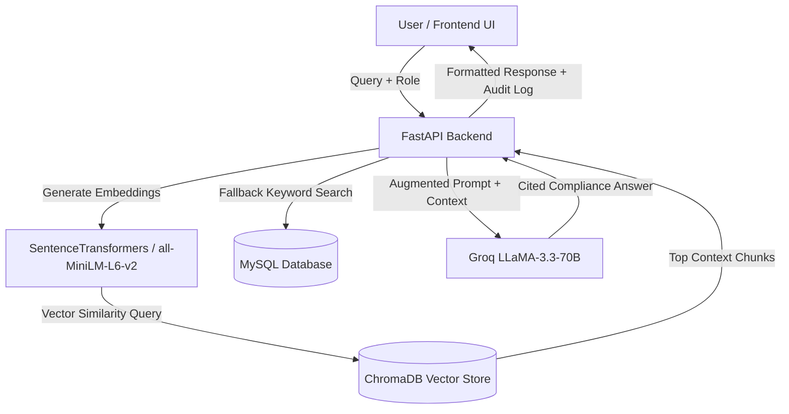

# 🏎️ BAJA RuleBot - Intelligent Rulebook Assistant & Compliance Engine

[](https://python.org)
[](https://fastapi.tiangolo.com)
[](https://mysql.com)
[](https://www.trychroma.com/)
[](https://groq.com)
[](https://tailwindcss.com)

> **An AI-powered Retrieval-Augmented Generation (RAG) compliance assistant designed specifically for BAJA SAEINDIA collegiate engineering teams, faculty advisors, and technical inspectors.**

---

## 📌 Executive Summary

**BAJA SAEINDIA** is an intercollegiate engineering design competition where student teams build rugged, single-seat, off-road vehicles. With a rulebook spanning over 120+ pages of dense technical, electrical, safety, and administrative specifications, manual verification is time-consuming and error-prone.

**BAJA RuleBot** solves this by providing:
1. **Instant, Role-Tailored Answers**: Adapts responses to Team Captains, Faculty Advisors, Finance Managers, Department Managers, and Technical Members.
2. **Strict Grounding & Zero Hallucination**: Employs semantic chunking and high-dimension vector search with ChromaDB and Groq LLaMA-3.3-70B to cite exact rule sections.
3. **Dynamic Inspection Checklists**: Generates actionable, itemized checklists with persistence for technical scrutiny.
4. **Enterprise-Grade Security**: Features PBKDF2-HMAC cryptographic password hashing, SMTP OTP authentication, and environment isolation.

---

## 🛠️ Architecture & Workflow



---

## ✨ Key Features

- **Role-Based Compliance Profiles**:
  - 🏎️ **Team Member**: Technical tolerances, roll cage geometry, powertrain, brake test criteria.
  - 📋 **Team Captain**: Rule changes, competition milestones, penalties, team responsibilities.
  - 🎓 **Faculty Advisor**: Student eligibility, academic verifications, registration deadlines.
  - 💰 **Finance Manager**: Cost reports, GST invoicing, BOM compliance, approved vendor lists.
  - ⚙️ **Department Manager**: Resource management, departmental workflows, internal approvals.
- **RAG & Semantic Retrieval**: Uses `all-MiniLM-L6-v2` dense embeddings combined with ChromaDB for instant rule retrieval.
- **Automated Rulebook Ingestion**: Parses PDFs via `pdfplumber`, performs semantic chunking, and indexes documents with single-click admin global uploads.
- **Interactive Checklists**: Generate, save, and check off rule compliance items per subsystem (e.g., Roll Cage, Brakes, High Voltage / eBAJA, Safety).
- **Admin Dashboard**: Real-time user management, query audit logs, user feedback analytics, and global rulebook orchestration.
- **Security & Account Recovery**: PBKDF2-HMAC-SHA256 salted password hashing and 6-digit OTP email recovery.

---

## 🗄️ Database Schema & Architecture

The database `baja_rulebot` contains 6 relational tables designed for compliance tracking and user session management:

| Table | Description |
|---|---|
| `users` | User credentials, hashed passwords, roles (`Team Member`, `Faculty Advisor`, etc.), team name, admin status. |
| `chat_history` | Historical queries, AI responses, user satisfaction feedback (`up`/`down`), timestamps. |
| `rulebooks` | Metadata of uploaded rulebooks (filename, disk path, global availability flag). |
| `rulebook_chunks` | Tokenized text chunks for keyword fallback search. |
| `password_otp` | Temporary 6-digit one-time password verification tokens with 10-minute expiry. |
| `checklists` | JSON-serialized compliance checklist states per user and category. |

> SQL definition available in [`backend/schema.sql`](file:///c:/Users/ASUS/OneDrive/Desktop/baja-rulebot/backend/schema.sql).

---

## 🚀 Quickstart Guide for Examiners & Evaluators

### 1. Prerequisites
- **Python**: 3.10 or 3.11+
- **MySQL**: 8.0+ running locally or in cloud
- **Groq API Key**: (Free at [console.groq.com](https://console.groq.com/keys))

---

### 2. Clone & Environment Setup

```bash
# Clone the repository
git clone https://github.com/Utsav-047/baja-rulebot.git
cd baja-rulebot

# Create and activate virtual environment
python -m venv venv
# On Windows:
venv\Scripts\activate
# On Linux/macOS:
source venv/bin/activate

# Install dependencies
pip install -r requirements.txt
```

---

### 3. Environment Configuration

Copy `.env.example` to `backend/.env` (or project root `.env`):

```bash
cp .env.example backend/.env
```

Configure your parameters in `backend/.env`:
```env
# AI Model API Key (Required)
API_KEY=gsk_your_groq_api_key_here

# Email OTP Recovery (Optional)
EMAIL=your_email@gmail.com
EMAIL_PASSWORD=your_gmail_app_password

# Database Configuration
MYSQLHOST=localhost
MYSQLPORT=3306
MYSQLUSER=root
MYSQLPASSWORD=your_mysql_password
MYSQL_DATABASE=baja_rulebot
```

---

### 4. Database Setup

The backend automatically creates all required tables on startup! However, you can also run `schema.sql` manually:

```bash
mysql -u root -p < backend/schema.sql
```

---

### 5. Run Backend Server

```bash
# Start FastAPI server from root or backend
uvicorn backend.main:app --host 127.0.0.1 --port 8000 --reload
```

- API Status: [http://127.0.0.1:8000/](http://127.0.0.1:8000/)
- Interactive OpenAPI Docs: [http://127.0.0.1:8000/docs](http://127.0.0.1:8000/docs)

---

### 6. Run Frontend Application

Simply open `frontend/index.html` in any modern web browser or serve via Live Server:

```bash
# Optional: using Python's simple HTTP server
cd frontend
python -m http.server 5500
```
Visit: [http://127.0.0.1:5500](http://127.0.0.1:5500)

---

## 📡 API Reference Overview

| Method | Endpoint | Description |
|---|---|---|
| `GET` | `/` | API status and active rulebook details |
| `POST` | `/register` | Register new user with hashed password |
| `POST` | `/login` | Authenticate user against hashed password |
| `POST` | `/chat` | Submit question with role context for AI answer |
| `POST` | `/feedback` | Submit feedback (helpful / not helpful) |
| `GET` | `/history/{user_id}` | Retrieve chat history for specific user |
| `POST` | `/checklist/generate` | Generate compliance checklist items for category |
| `POST` | `/checklist/save` | Save state of user checklist |
| `GET` | `/checklist/{user_id}/{cat}` | Load saved checklist |
| `POST` | `/admin/upload-global` | Admin upload global rulebook PDF |
| `GET` | `/admin/users` | List all registered users |
| `GET` | `/admin/chats` | List all chat interactions and analytics |
| `POST` | `/forgot-password/send-otp`| Send password reset code via email |
| `POST` | `/forgot-password/reset` | Verify OTP and reset password |

---

## ☁️ Deployment Guide (Railway / Cloud)

This repository includes native cloud configuration files (`railway.json`, `Procfile`, `nixpacks.toml`, `requirements.txt`):

1. **Railway Deployment**:
   - Link this GitHub repository in [Railway.app](https://railway.app).
   - Add a MySQL service and link it to the backend service.
   - Configure environment variables (`API_KEY`, `EMAIL`, `EMAIL_PASSWORD`, `MYSQLHOST`, etc.).
   - Railway builds and deploys automatically using `uvicorn backend.main:app --host 0.0.0.0 --port $PORT`.

2. **Frontend Deployment**:
   - Deploy `frontend/` folder to **Vercel**, **Netlify**, or **GitHub Pages**.
   - `frontend/config.js` will automatically route to production or allow runtime URL override.

---

## 🔒 Security Practices

- **Zero Hardcoded Secrets**: All API keys, passwords, and connection strings are managed strictly via environment variables.
- **Git Protection**: Protected by root `.gitignore` ensuring `.env`, temporary files, vector stores, and uploads are never exposed.
- **Password Security**: Implements OWASP-compliant `PBKDF2-HMAC-SHA256` with 100,000 rounds and random salt.
- **CORS Middleware**: Explicit CORS policy configured in FastAPI.

---

## 👥 Contributors & Academic Credits

- **Project Developer**: Utsav Patel
- **Department**: Artificial Intelligence and Machine Learning
- **Institution**: Charotar University of Science and Technology (CHARUSAT)
- **Domain**: BAJA SAEINDIA Collegiate Design Series & Rule Compliance Assistant